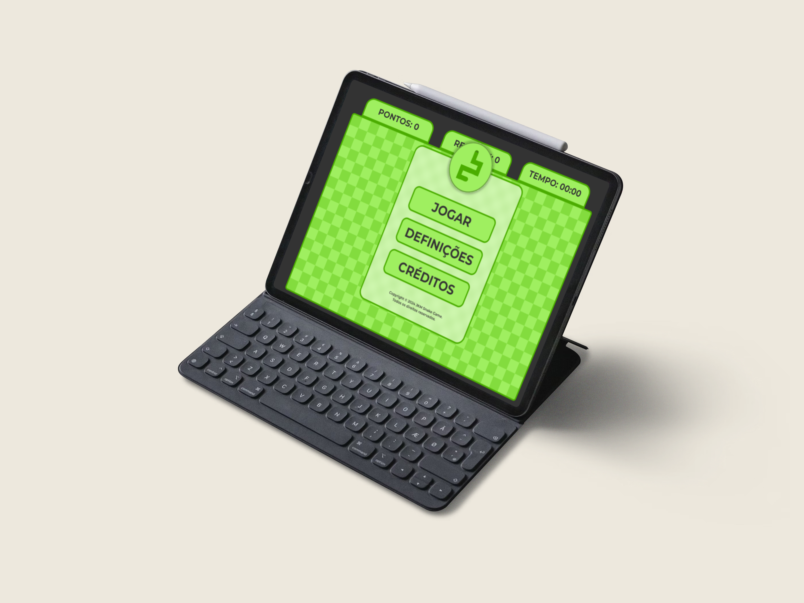

  
# Jornada da Kobra Mística - JKM Snake Game

Clique na imagem abaixo para visualizar!

## Jornada de criação:

### Introdução:
Criar o clássico jogo da cobrinha no front-end é como ser um mestre de pixels. Para criar este jogo, utilizamos apenas o trio do front-end: HTML, CSS e JavaScript para dar vida a esse desafio retrô. Imaginamos a tela como um pergaminho mágico e use CSS para deixá-la incrível. Depois, colocamos uma forma à cobra com JavaScript, controlando-a para devorar maçãs pixeladas. Aumentamos a dificuldade com obstáculos e sons, e finalizamos com telas de início e fim. Veja também como foi o processo de criação do jogo acessando o projeto do Figma:
http://gg.gg/figma-jkm

### Organização do projeto:
O método "Scrum" foi utilizado para gerenciar o desenvolvimento do jogo, proporcionando organização, comunicação e entrega eficiente do projeto. Através de sprints curtos e entregas frequentes, a equipe pôde trabalhar de forma colaborativa e se adaptar a mudanças e prioridades. A metodologia contribuiu para o sucesso do projeto, apesar de alguns desafios como a estimativa de tempo e a comunicação clara. Recomenda-se treinamento da equipe, uso de ferramentas de suporte e adaptação da metodologia às necessidades do projeto.

## Tecnologias utilizadas:
### Tecnologias para dar vida à Cobra Pixelada:
- HTML: A base da estrutura do jogo, definindo a tela e elementos como título, instruções e pontuação.
- CSS: Responsável pela estética do jogo, estilizando cores, fontes, animações e layout da tela.
- JavaScript: O motor do jogo, controlando a lógica, movimento da cobra, colisões, geração de maçãs e obstáculos.
- Canvas: Uma área específica dentro da página HTML, utilizada para desenhar a cobra e os demais elementos do jogo com JavaScript.
- Orientação a Objetos: Uma técnica de programação que organiza o código em objetos com características e comportamentos específicos, facilitando a reutilização e manutenção do código.

### Tecnologias Opcionais:
- Web Audio API: Permite adicionar sons e efeitos sonoros ao jogo, criando uma experiência mais envolvente.
- Bibliotecas JavaScript: Diversas bibliotecas podem ser utilizadas para facilitar o desenvolvimento do jogo, como bibliotecas para animações e sons.

## Como jogar:
Assuma o controle da cobra pixelada neste clássico jogo e guie-a por uma aventura desafiadora. Utilize as setas do teclado ou wasd para controlar seus movimentos, coletando maçãs para aumentar seu tamanho e evitando colisões com o próprio corpo ou obstáculos. Aumente a velocidade ao decorrer do jogo para testar seus reflexos. Encare o desafio de bater seu próprio recorde. Mergulhe na nostalgia com sons vibrantes e gráficos retrô, desfrutando de uma experiência divertida e viciante.

## SQUAD:
- (Developer) José Gabriel ([@naasdd](https://github.com/naasdd))
- (Developer) Kauã Biasebetti ([@kauuaa](https://github.com/kauuaa))
- (Scrum Master & Developer) Matheus Pompeo ([@mapompeo](https://github.com/mapompeo))

## Considerações finais:
O projeto JKM Snake Game resultou em um jogo completo e funcional, utilizando HTML, CSS e JavaScript. Diversas funcionalidades foram implementadas para aumentar o desafio e a diversão. O desenvolvimento proporcionou aprendizados valiosos sobre lógica de programação, orientação a objetos e principalmente resolução de problemas. O jogo está publicado online e disponível para qualquer pessoa jogar e acessar atráves do link: https://jkm-snake.netlify.app. Gostaríamos de agradecer ao Professor Carlos Roberto ([@Prof-Carlos-Senai](https://github.com/Prof-Carlos-Senai)) por sua orientação, suporte e incentivo durante o desenvolvimento do projeto. Sua disponibilidade foi fundamental para o sucesso do projeto.

## Licença:
Este projeto está licenciado sob a licença MIT. Consulte o arquivo LICENSE para mais informações.

> **Este projeto foi realizado no primeiro semestre de 2024 no _[SENAI](https://maps.app.goo.gl/Jw1hZ8uvuVqV3V9E9)_ de _[Tijucas SC](https://maps.app.goo.gl/UFumcc5hjGymGFSY7)_.**

